# CLASS.md

`SEQUENCE.md`（Phase 1 dry-run中心）・`SPEC.md`（v0.6-draft）・`USECASE.md`に基づくクラス設計。

対象範囲は、`SEQUENCE.md`の主要コンポーネント（3章）と、そこに登場する参加者（4〜9章の各シーケンス図）をクラス・インターフェースとして具体化したものである。Phase 1（dry-run）実装に必要なクラスを中心に、Phase 3（real-CLI接続）関連クラスも含めて記載する。Phase 3専用クラスにはその旨を注記する。

---

## 1. クラス図

```mermaid
classDiagram
    class Runner {
        +main(argv) int
        -parse_args(argv) RunOptions
        -validate_args(options) void
    }

    class RunOptions {
        +int games
        +Mode mode
        +int seed
    }

    class Mode {
        <<enumeration>>
        DRY_RUN
        REAL_AGENTS
    }

    class ConfigLoader {
        +load(path) List~AgentConfig~
    }

    class AgentConfig {
        +str name
        +str command
        +List~str~ args
        +str prompt_mode
    }

    class RandomGenerator {
        -Random rng
        +__init__(seed)
        +shuffle_roles() List~Role~
        +choice(candidates) str
    }

    class Role {
        <<enumeration>>
        WEREWOLF
        SEER
        VILLAGER
    }

    class GameEngine {
        +__init__(agent_configs, player_agent, validator, fallback_handler, log_writer, rng)
        +run_one_game(game_id) GameResult
        -assign_roles(agent_configs, rng) Dict~str, Role~
        -run_night_phase(state, agent) SeerResult
        -run_speech_round(state, agent) List~SpeechEntry~
        -run_vote_round(state, agent) List~VoteEntry~
        -determine_execution(votes, rng) str
        -determine_winner(executed_role) str
    }

    class PlayerAgent {
        <<interface>>
        +generate_night_action(seer, candidates) str
        +generate_speech(player, public_log) str
        +generate_vote(player, public_log) str
    }

    class DryRunAgent {
        -RandomGenerator rng
        +__init__(rng)
        +generate_night_action(seer, candidates) str
        +generate_speech(player, public_log) str
        +generate_vote(player, public_log) str
    }

    class AgentInvoker {
        +generate_night_action(seer, candidates) str
        +generate_speech(player, public_log) str
        +generate_vote(player, public_log) str
        -invoke(agent_config, prompt) str
    }

    class PromptBuilder {
        +build_night_prompt(seer, candidates) str
        +build_speech_prompt(player, public_log) str
        +build_vote_prompt(player, public_log) str
    }

    class JsonValidator {
        +validate(raw_response, phase, player, context) ValidationResult
    }

    class ValidationResult {
        +bool ok
        +Dict action
        +str error_type
    }

    class FallbackHandler {
        -RandomGenerator rng
        +__init__(rng)
        +decide_speech() str
        +decide_target(candidates) str
    }

    class LogWriter {
        -Path logs_root
        +__init__(logs_root)
        +next_game_id() int
        +create_game_dir(game_id) void
        +init_game_state(game_id) GameState
        +save_game_state(state) void
        +append_public_log(text) void
        +save_results(state, speeches, votes, errors) void
        +save_raw_response(seq, phase, player, error_type, content) void
    }

    class GameState {
        +int game_id
        +PhaseValue phase
        +Dict~str, PlayerState~ players
        +SeerResult seer_result
        +str executed
        +str winner
    }

    class PhaseValue {
        <<enumeration>>
        SETUP
        NIGHT
        SPEECH
        VOTE
        FINISHED
    }

    class PlayerState {
        +Role role
    }

    class SeerResult {
        +str seer
        +str target
        +str result
    }

    class SpeechEntry {
        +str player
        +str speech
        +str reason
    }

    class VoteEntry {
        +str player
        +str vote
        +str reason
    }

    class GameResult {
        +int game_id
        +str executed
        +str winner
    }

    Runner --> RunOptions : parses
    Runner --> ConfigLoader : uses
    Runner --> RandomGenerator : creates once and shares
    Runner --> LogWriter : uses
    Runner --> GameEngine : creates per game
    RunOptions --> Mode

    ConfigLoader --> AgentConfig : loads list of

    GameEngine --> PlayerAgent : uses (Dry or Invoker, by mode)
    GameEngine --> JsonValidator : uses
    GameEngine --> FallbackHandler : uses
    GameEngine --> LogWriter : uses
    GameEngine --> RandomGenerator : uses
    GameEngine --> GameState : creates/updates
    GameEngine --> GameResult : returns

    DryRunAgent ..|> PlayerAgent : implements
    DryRunAgent --> RandomGenerator : same instance
    AgentInvoker ..|> PlayerAgent : implements
    AgentInvoker --> PromptBuilder : uses
    AgentInvoker --> AgentConfig : uses

    JsonValidator --> ValidationResult : returns
    FallbackHandler --> RandomGenerator : uses

    GameState *-- PlayerState : contains
    GameState o-- SeerResult : has
    GameState --> PhaseValue

    LogWriter --> GameState : reads/writes
    LogWriter --> SpeechEntry : appends
    LogWriter --> VoteEntry : appends
```

---

## 2. クラス一覧

| クラス | 責務 | 対応SEQUENCE.md章 | 想定配置ファイル（SPEC.md 14章） | Phase |
|---|---|---|---|---|
| `Runner` | CLI引数解析、モード判定、`--games`ループ制御のエントリポイント | 4, 5, 9.1(15.5) | `scripts/run_game.py` | 1 |
| `RunOptions` | 解析済みCLIオプション（games/mode/seed） | 4 | `scripts/run_game.py` | 1 |
| `Mode` | `DRY_RUN` / `REAL_AGENTS` の実行モード | 4 | `scripts/run_game.py` | 1 |
| `ConfigLoader` | `config/agents.json` の読み込み | 4 | `scripts/agents.py` | 1 |
| `AgentConfig` | 1プレイヤー分の呼び出し設定（command/args/prompt_mode） | 4 | `scripts/agents.py` | 1 |
| `RandomGenerator` | 起動時に1つだけ初期化される単一乱数生成器のラッパー | 4, 6 | `scripts/random_utils.py` | 1 |
| `Role` | `WEREWOLF` / `SEER` / `VILLAGER` | 4 | `scripts/models.py` | 1 |
| `GameEngine` | 1試合の進行制御（役職割当・夜・昼・処刑・勝敗判定） | 4 | `scripts/game_rules.py` | 1 |
| `PlayerAgent` | 発言・投票・占いのJSON生成インターフェース | 4, 7, 8 | `scripts/agents.py` | 1/3共通 |
| `DryRunAgent` | `PlayerAgent`実装。固定テンプレート・シード付き乱数でJSONを生成 | 4 | `scripts/agents.py` | 1 |
| `AgentInvoker` | `PlayerAgent`実装。一時ディレクトリで外部CLIを呼び出す | 8 | `scripts/agents.py` | 3 |
| `PromptBuilder` | 実CLI用プロンプト本文の組み立て | 8 | `scripts/agents.py` | 3 |
| `JsonValidator` | 応答の構文検証・内容検証 | 7 | `scripts/json_utils.py` | 1 |
| `ValidationResult` | 検証結果（OK/NG、パース済みアクション、error_type） | 7 | `scripts/json_utils.py` | 1 |
| `FallbackHandler` | 検証NG時のフォールバック行動決定 | 7 | `scripts/game_rules.py` | 1 |
| `LogWriter` | 試合ディレクトリ採番・作成、`game_state.json`/`public_log.md`/`results.md`/`raw/`の読み書き | 4, 9 | `scripts/log_writer.py` | 1 |
| `GameState` | `game_state.json`に対応する試合状態 | 4, 9 | (データ) | 1 |
| `PhaseValue` | `phase`の許容値（`setup`/`night`/`speech`/`vote`/`finished`） | 9 | (データ) | 1 |
| `PlayerState` | 1プレイヤーの役職 | 4 | (データ) | 1 |
| `SeerResult` | 占い結果（`seer`/`target`/`result`） | 4, 9 | (データ) | 1 |
| `SpeechEntry` | 発言ラウンド1件分の記録 | 4 | (データ) | 1 |
| `VoteEntry` | 投票ラウンド1件分の記録 | 4 | (データ) | 1 |
| `GameResult` | 1試合の結果（`executed`/`winner`） | 4 | (データ) | 1 |

---

## 3. 設計判断

### 3.1 `PlayerAgent` インターフェースによるPhase 1/3の共通化

`SEQUENCE.md` 7章の「JSON検証・フォールバックシーケンス」は、参加者を `DryRunAgent or AgentInvoker` と1つの箱で表現しており、`GameEngine` から見て両者が同じ手順（行動要求→生応答→検証→フォールバック）で扱われることを示している。これを踏まえ、`PlayerAgent` インターフェースを新設し、`DryRunAgent`（Phase 1）と `AgentInvoker`（Phase 3）の双方がこれを実装する設計とした。`GameEngine` は `PlayerAgent` 型としてのみ依存し、モード（`Mode.DRY_RUN` / `Mode.REAL_AGENTS`）に応じて実装を切り替える。

### 3.2 `LogWriter` の責務範囲

`SEQUENCE.md` では、試合ディレクトリの採番・作成（4章・5章）と、`game_state.json` / `public_log.md` / `results.md` / `raw/` への書き込み（4章・7章・9章）がいずれも同じ `LogWriter`（参加者名 `Log`）に集約されている。そのため `CLASS.md` でも1クラスとしたが、責務がやや広い（ディレクトリ管理とファイル内容の永続化の両方を持つ）。Phase 1実装時に、ディレクトリ管理部分を別クラスに分離するかどうかは実装判断に委ねてよく、設計をブロックするものではない。

### 3.3 Phase 1の依存注入とテスト容易性

- `DryRunAgent`は`RandomGenerator`をコンストラクタで受け取る。
- `GameEngine`は`PlayerAgent`、`JsonValidator`、`FallbackHandler`、`LogWriter`、`RandomGenerator`をコンストラクタで受け取り、テストダブルへ差し替え可能にする。
- `DryRunAgent`、`GameEngine`、`FallbackHandler`は、Runnerが起動時に1つだけ作成した同じ`RandomGenerator`インスタンスを共有する。
- `LogWriter`は試合ディレクトリ群を格納する`logs_root`をコンストラクタで受け取る。本番は`logs/games`、pytestでは`tmp_path`配下を渡す。

---

## 4. QandA.mdに記録した不明点

`SPEC.md` 14章のファイル構成は `run_game.py` / `agents.py` / `game_rules.py` / `json_utils.py` の4ファイルのみを列挙しているが、本クラス設計はこの4ファイルへの割り当てを前提にしている。後工程（実装時のファイル分割）に影響しうる点をQandA.mdに記録した（Q41参照）。
