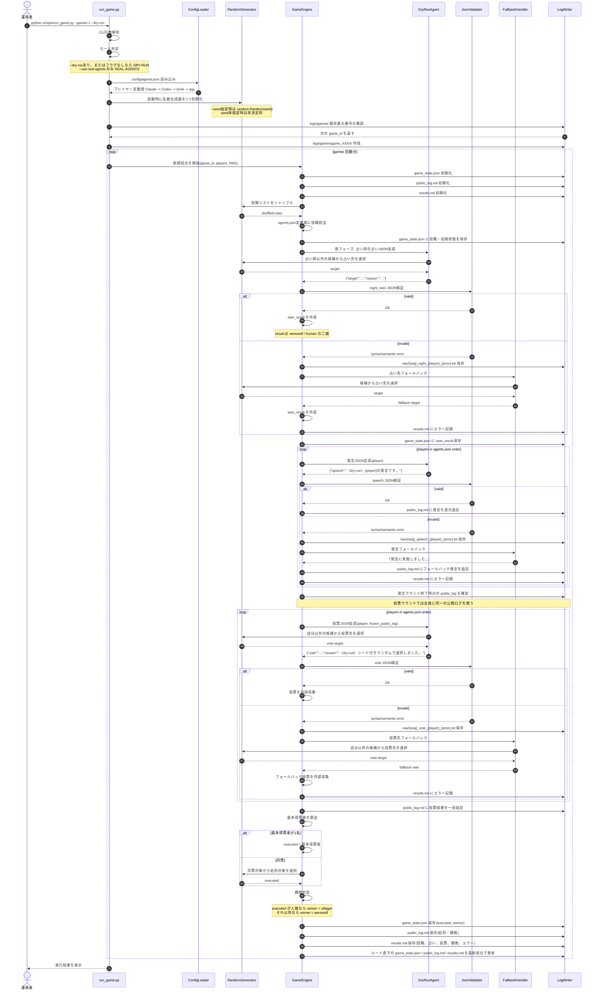
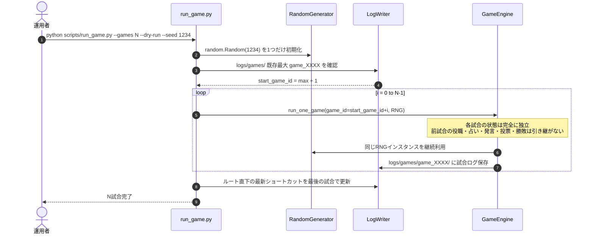
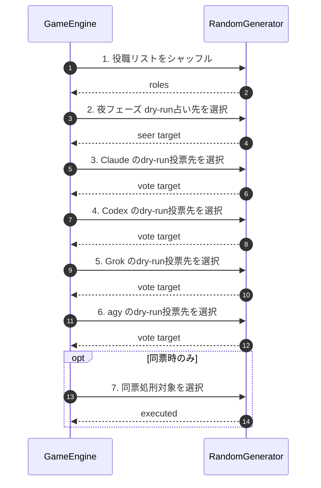
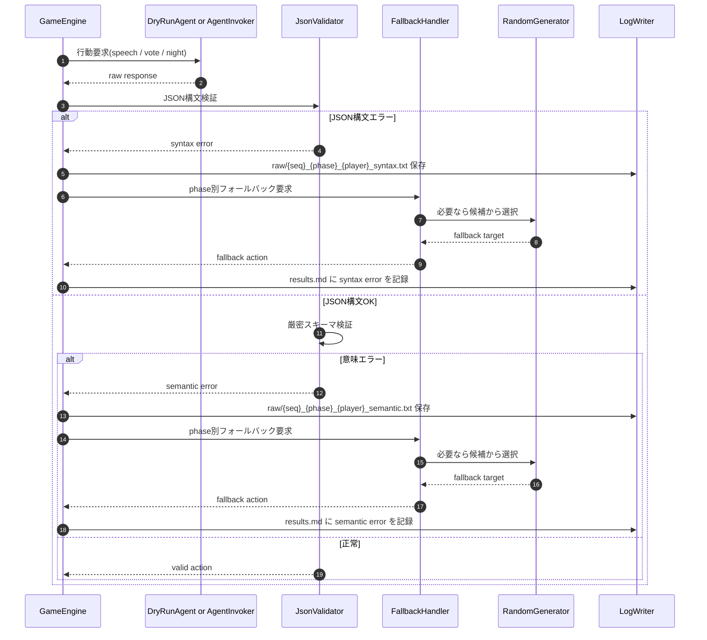
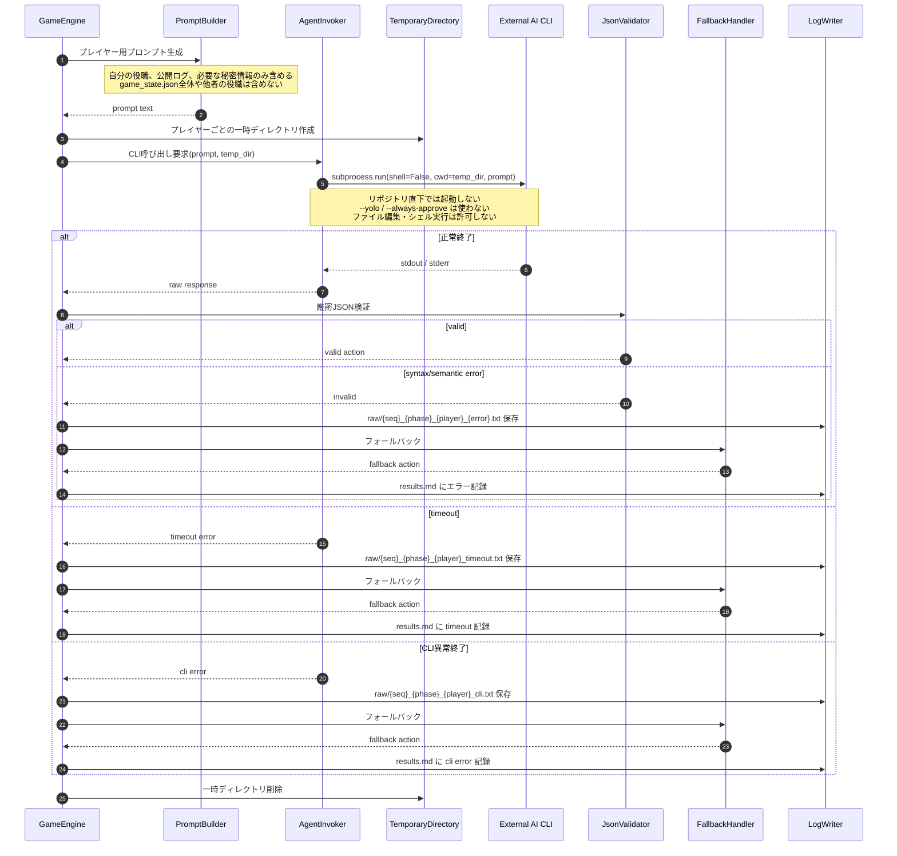

# SEQUENCE.md

## Project: AI Multi-Agent Werewolf Game (One Night Werewolf)

Version: 0.1-draft  
Based on: `SPEC.md` v0.5-draft / `USECASE.md` / `QandA.md`  
Primary target: Phase 1 dry-run implementation

---

## 1. 目的

本書は、Phase 1 dry-run実装において、以下のコマンドがどの順序で処理されるべきかを明確にする。

```bash
python scripts/run_game.py --games 1 --dry-run
```

また、`--games N` による複数試合ループ、JSON検証・フォールバック、ログ保存、Phase 3 real-CLI接続時の参考シーケンスも併せて記載する。

---

## 2. 前提

### 2.1 参照仕様

- `SPEC.md` v0.5-draft
- `USECASE.md`
- `QandA.md`

### 2.2 対象範囲

本書の主対象は Phase 1 dry-run である。

Phase 1では、外部AI CLIを呼び出さない。  
Claude / Codex / Grok / agy の応答は、システム内部のdry-runダミー応答ロジックが生成する。

Phase 3 real-CLI接続は、参考シーケンスとして別章に記載する。

### 2.3 USECASE.mdとの対応

| UC | 概要 | 本書での扱い |
|---|---|---|
| UC-01 | dry-runで1試合実行する | 主対象 |
| UC-02 | 実CLIで1試合実行する | Phase 3参考 |
| UC-03 | 複数試合を連続実行する | Phase 1ループとして扱う |
| UC-04 | `--seed` により再現性を確保する | Phase 1では完全再現、Phase 3ではエンジン内乱数のみ再現 |
| UC-06 | 夜フェーズを実行する | dry-runでは内部ロジックが占いを生成 |
| UC-07 | 昼の発言ラウンドを実行する | dry-runでは固定テンプレート発言 |
| UC-08 | 投票ラウンドを実行する | dry-runではシード付き乱数で投票 |
| UC-09 | 処刑・勝敗判定を行う | Phase 1で実装対象 |
| UC-11 | 不正応答を検証しフォールバックする | Phase 1では syntax/semantic、Phase 3では timeout/cli も対象 |

---

## 3. 主要コンポーネント

```text
Operator
  運用者。run_game.py を実行する。

run_game.py
  CLI引数解析、モード判定、試合ループ全体を担当する。

GameEngine
  役職割当、夜フェーズ、昼フェーズ、投票、処刑、勝敗判定を担当する。

DryRunAgent
  Phase 1 dry-run時に、AIプレイヤーの代わりに正常JSONを生成する内部ロジック。

AgentInvoker
  Phase 3 real-CLI時に外部AI CLIを呼び出すコンポーネント。Phase 1では使用しない。

JsonValidator
  AI応答またはdry-run応答のJSON構文・意味検証を担当する。

FallbackHandler
  JSON不正、CLI失敗、タイムアウト時に代替行動を決定する。

LogWriter
  game_state.json、public_log.md、results.md、raw/ を保存する。

RandomGenerator
  run_game.py起動時に1つだけ初期化され、全試合で使い続ける乱数生成器。
```

---

## 4. Phase 1 dry-run 全体シーケンス

対象コマンド:

```bash
python scripts/run_game.py --games 1 --dry-run
```



---

## 5. `--games N` 複数試合ループ

対象ユースケース: UC-03 / UC-04



### 5.1 複数試合時のルール

- 試合ディレクトリは `logs/games/` の既存最大番号 + 1 から採番する。
- `--games N` は連続したN個のディレクトリを作成する。
- 各試合は完全に独立する。
- 乱数生成器は `run_game.py` 起動時に1つだけ作り、全試合で使い続ける。
- 1試合内でフォールバックが発生しても、N試合ループ全体は継続する。
- 致命的なファイル書き込みエラーなど、試合結果を保存できない場合のみ実行停止を許可する。

---

## 6. 乱数消費順

対象ユースケース: UC-04

`--seed` 指定時、Phase 1 dry-runでは同一シード・同一設定で試合結果を完全再現する。

1試合内の乱数消費順は以下で固定する。



### 6.1 候補リスト順

候補リストはすべて `config/agents.json` の定義順を使う。

初期設定:

```text
Claude -> Codex -> Grok -> agy
```

名前のソート順は使わない。

### 6.2 Phase 3 real-CLI時の再現性

Phase 3 real-CLI時は、外部AIの自然言語応答自体は再現対象外とする。

`--seed` によって再現する対象は以下に限定する。

- 役職割当
- フォールバック時の占い先・投票先
- 同票時の処刑対象

実CLIの正常応答時には、占い先・投票先はAI応答に従うため、dry-run時のように常に乱数を消費するとは限らない。

---

## 7. JSON検証・フォールバックシーケンス

対象ユースケース: UC-11

Phase 1では `syntax` / `semantic` を主対象とする。  
Phase 3では `timeout` / `cli` も対象に追加する。



### 7.1 厳密JSON検証ルール

Phase 1では、応答全体が単一JSONオブジェクトでなければ不正とする。

不正扱い:

- Markdownコードフェンス
- JSON前後の説明文
- 定義外キー
- 必須キー欠落
- 空文字
- `null`
- 型不一致
- 存在しないプレイヤー名
- 自分自身を占い先・投票先にするなど、フェーズごとの禁止対象

### 7.2 フォールバックの保存先

生応答は以下に保存する。

```text
logs/games/game_XXXX/raw/{seq:02d}_{phase}_{player}_{error_type}.txt
```

例:

```text
logs/games/game_0001/raw/01_night_Codex_syntax.txt
logs/games/game_0001/raw/02_vote_Grok_semantic.txt
```

---

## 8. Phase 3 real-CLI 参考シーケンス

対象ユースケース: UC-02 / UC-06 / UC-07 / UC-08 / UC-11

Phase 3では、DryRunAgentの代わりにAgentInvokerが外部AI CLIを呼び出す。



### 8.1 Phase 3の安全条件

- 外部AIはリポジトリ直下で起動しない。
- 外部AIはプレイヤーごとの一時ディレクトリで起動する。
- `game_state.json` や `private/` 情報は渡さない。
- 他プレイヤーの役職は渡さない。
- 渡すのはプロンプト本文のみとする。
- CLI出力は厳密JSON検証する。
- `--yolo` / `--always-approve` は使わない。
- AIプレイヤーにファイル編集や任意シェル実行を指示しない。

---

## 9. 保存ファイルの更新順

1試合ごとに、以下の順で保存する。

```text
1. logs/games/game_XXXX/game_state.json を初期化
2. logs/games/game_XXXX/public_log.md を初期化
3. logs/games/game_XXXX/results.md を初期化
4. 役職割当後、game_state.json を更新
5. 夜フェーズ後、seer_result を game_state.json に保存
6. 発言ラウンド中、public_log.md に発言を逐次追記
7. 投票ラウンド終了後、public_log.md に投票結果を一括追記
8. 処刑・勝敗判定後、game_state.json / public_log.md / results.md を保存
9. ルート直下の game_state.json / public_log.md / results.md を最新試合の内容で更新
```

`--games N` の場合、ルート直下の最新ショートカットは最後に完了した試合の内容とする。

---

## 10. 実装時の注意点

### 10.1 Q24〜Q29への対応方針

`QandA.md` の USECASE.mdレビューでは、Q24〜Q29 が未解決として記録されている。  
ただし、Phase 1のコード実装は `SPEC.md` v0.5-draft に従えば進められる。

本書では、シーケンス設計に関係する箇所を以下の前提で扱う。

- Q24: Mermaid sequenceDiagramではinclude/extend矢印を扱わないため、直接影響なし。
- Q25: UC-03はPhase 1の複数試合逐次実行ループとして扱う。横断集計はUC-12 / Phase 4。
- Q26: UC-11はPhase 1/3横断とし、Phase 1はsyntax/semantic、Phase 3はtimeout/cliも対象。
- Q27: UC-04の完全再現はPhase 1 dry-runのみ。Phase 3はエンジン内乱数のみ再現。
- Q28: 本書でUC-03の詳細シーケンスを補足した。
- Q29: 本書で乱数消費順をSPEC 16.5相当に揃えた。

### 10.2 Phase 1実装で優先すること

- `python scripts/run_game.py --games 1 --dry-run` が最後まで通ること。
- `python scripts/run_game.py --games 10 --dry-run --seed 1234` が毎回同じ結果になること。
- 外部AI CLIを一切呼ばないこと。
- JSON検証・フォールバックは、通常dry-runでは発火しないが、ユニットテストで検証できる構造にすること。

---

## 11. Phase 1 dry-run実装可否

本書の範囲では、Phase 1 dry-run実装に進める。

理由:

- ゲーム進行順が確定している。
- 乱数消費順が確定している。
- dry-run応答の生成方針が確定している。
- 投票の同時性と公開タイミングが確定している。
- 保存ファイルとディレクトリ採番が確定している。
- JSONエラー・意味エラー時のフォールバック方針が確定している。

USECASE.md側の図表修正（Q24〜Q29）は別途行うべきだが、Phase 1実装そのものをブロックしない。
