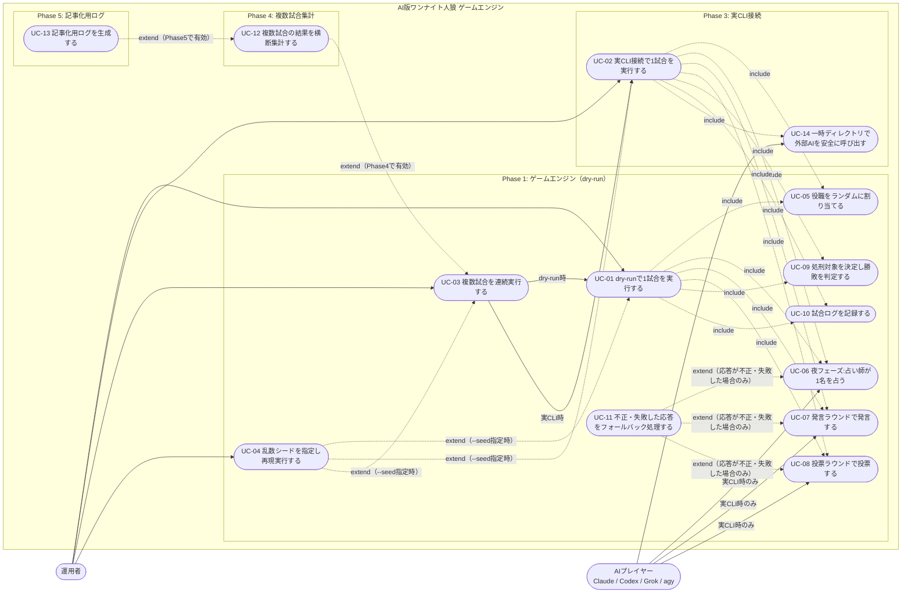

# USECASE.md

`SPEC.md`（v0.5-draft、AI版ワンナイト人狼）に基づくユースケース定義。

対象範囲は、SPEC.md 20章に定義された Phase 1〜5 の全機能とする。各ユースケースには実装フェーズをタグ付けしており、現時点で実装対象なのは **Phase 1** のユースケースのみである（Phase 2〜5 は将来実装・設計検討用として記載）。

---

## 1. アクター

| アクター | 説明 |
|---|---|
| 運用者（Operator） | `python scripts/run_game.py` を実行する人間。試合の開始条件（試合数・dry-run/実CLI・乱数シード）を指定する。 |
| AIプレイヤー（Claude / Codex / Grok / agy） | 実CLI接続時（`--use-real-agents`）にのみ登場する外部アクター。ゲームマスターから渡されたプロンプトに対し、発言・投票・占いをJSONで返す。 |
| （システム内部）ダミー応答ロジック | dry-run時（デフォルト）に、外部AIプレイヤーの代わりに発言・投票・占いのJSONを生成する。アクターではなくシステム内部の振る舞いだが、UC-06〜08の主体がdry-runと実CLIで入れ替わることを示すため注記する（SPEC.md 15.1章）。 |

---

## 2. ユースケース図

**凡例**: 実線＝アクターからの直接起動、または「dry-run時/実CLI時」など条件付き分岐。破線ラベル `include`＝基底UCが必ず実行するサブケース（基底UC→被includeの向き）。破線ラベル `extend`＝拡張側UCが条件付きで基底UCに機能を追加する関係（UML準拠で拡張UC→基底UCの向き。例: UC-04は`--seed`指定時のみUC-01/02/03を拡張し、UC-11は応答が不正・失敗した場合のみUC-06/07/08を拡張する）。

---

## 3. ユースケース一覧

| ID | 名称 | Phase | アクター | 関連SPEC章 |
|---|---|---|---|---|
| UC-01 | dry-runで1試合を実行する | 1 | 運用者 | 8, 15.1, 21 |
| UC-02 | 実CLI接続で1試合を実行する | 3 | 運用者, AIプレイヤー | 8, 15.2, 16 |
| UC-03 | 複数試合を連続実行する（`--games N`） | 1 | 運用者 | 14, 15.3, 20 Phase1 |
| UC-04 | 乱数シードを指定し再現実行する（`--seed`） | 1（完全再現）/ 3（エンジン内乱数のみ再現） | 運用者 | 15.4, 16.5 |
| UC-05 | 役職をランダムに割り当てる | 1 | （システム内部） | 6, 16.5 |
| UC-06 | 夜フェーズ：占い師が1名を占う | 1 / 3 | AIプレイヤー（実CLI時）/ システム内部（dry-run時） | 9, 11.3 |
| UC-07 | 発言ラウンドで発言する | 1 / 3 | AIプレイヤー（実CLI時）/ システム内部（dry-run時） | 10.1, 11.1 |
| UC-08 | 投票ラウンドで投票する | 1 / 3 | AIプレイヤー（実CLI時）/ システム内部（dry-run時） | 10.2, 11.2 |
| UC-09 | 処刑対象を決定し勝敗を判定する | 1 | （システム内部） | 7, 13 |
| UC-10 | 試合ログを記録する | 1 | （システム内部） | 14, 17 |
| UC-11 | 不正・失敗した応答をフォールバック処理する | 1（syntax/semantic）/ 3（+timeout/cli） | （システム内部） | 12, 19 |
| UC-12 | 複数試合の結果を横断集計する | 4 | （システム内部、UC-03から派生） | 20 Phase4 |
| UC-13 | 記事化用ログを生成する | 5 | （システム内部、運用者が閲覧） | 20 Phase5 |
| UC-14 | 一時ディレクトリで外部AIを安全に呼び出す | 3 | （システム内部） | 16.2 |

---

## 4. 主要ユースケース詳細

### UC-01: dry-runで1試合を実行する

- **アクター**: 運用者
- **トリガー**: `python scripts/run_game.py --games 1`（フラグなし）または `--dry-run` を付けて実行
- **事前条件**: なし（外部AI CLIの準備は不要）
- **主フロー**:
  1. 運用者がコマンドを実行する。
  2. システムはUC-05で役職をランダムに割り当てる。
  3. システムはUC-06（夜フェーズ、ダミー占い）を実行する。
  4. システムはUC-07・UC-08（発言ラウンド・投票ラウンド、ダミー応答）を実行する。
  5. システムはUC-09で処刑対象を決定し勝敗を判定する。
  6. システムはUC-10で `logs/games/game_XXXX/` にログを記録する。
- **事後条件**: `results.md` に勝敗が、`public_log.md` に公開ログが記録される（SPEC.md 21章 成功条件）。
- **例外**: 発生しない（dry-runは外部プロセスを呼ばないため、UC-11のフォールバックは通常発火しない。12章の検証・フォールバック自体はコードとして実装され、ユニットテストで別途確認する。20章 Phase1参照）。

### UC-02: 実CLI接続で1試合を実行する

- **アクター**: 運用者、AIプレイヤー
- **トリガー**: `python scripts/run_game.py --games 1 --use-real-agents`
- **事前条件**: `config/agents.json` に4プレイヤー分の呼び出し設定（`command`, `args`, `prompt_mode`）が存在する。
- **主フロー**: UC-01と同じ進行だが、UC-06〜08の発言・投票・占いは、UC-14（一時ディレクトリでの隔離実行）を介してAIプレイヤー（外部CLIプロセス）が生成する。
- **事後条件**: UC-01と同じ。加えて、各AI呼び出しの作業ディレクトリは終了後に削除されている。
- **例外**: CLIタイムアウト（180秒、19章）、CLI異常終了、JSON構文・内容不正が発生した場合はUC-11のフォールバックが発火し、ゲームは停止せず続行する。

### UC-06: 夜フェーズ：占い師が1名を占う

- **アクター**: AIプレイヤー（実CLI時）／システム内部（dry-run時）
- **事前条件**: 役職割り当て（UC-05）が完了している。
- **主フロー**:
  1. 占い師に割り当てられたプレイヤーへ、占い用プロンプトとプレイヤー一覧を渡す。
  2. 占い師が自分以外の3名から1名を選ぶ（11.3 占い師占い出力JSON）。
  3. 結果を人狼／人間の二値（`werewolf` / `human`）で `seer_result` に記録する（17.3章）。
- **事後条件**: `seer_result` が確定し、占い師本人にのみ以降の情報として渡せる状態になる。公開ログには出さない。
- **例外**: 応答が構文不正・内容不正・タイムアウト・CLI異常終了のいずれかの場合、UC-11によりランダムな占い先にフォールバックする。

### UC-04: 乱数シードを指定し再現実行する

- **アクター**: 運用者
- **トリガー**: `--seed X` オプションを付けて実行（UC-01/UC-02/UC-03を拡張する `extend`）。
- **事前条件**: なし。
- **主フロー**（乱数生成器の消費順は16.5章の1〜4にそのまま従う）:
  1. `run_game.py` 起動時に、指定シード `X` から単一の乱数生成器（`random.Random(X)` 等）を1つだけ初期化する。
  2. **役職の割り当て（UC-05）**: 役職リストをシャッフルし、`config/agents.json` の定義順に割り当てる。
  3. **夜フェーズの占い先決定（UC-06）**: dry-run時、または実CLI時にフォールバックが発生した場合にのみ乱数を消費する。実CLIが正常応答した場合は乱数を消費しない（占い先はAI自身の判断による）。
  4. **投票ラウンドの投票先決定（UC-08）**: 上記3と同様、dry-run時、またはフォールバック時にのみ乱数を消費する。
  5. **同票処刑対象の決定（UC-09）**: 同票が発生した場合のみ、候補（`config/agents.json` 定義順）から乱数で1名選ぶ。
  - 発言ラウンドの呼び出し順（UC-07）は `config/agents.json` の固定順であり、乱数は消費しない。
  6. `--games N` 指定時は、この乱数生成器のインスタンスを全試合を通して使い続ける（試合ごとの再初期化は行わない）。
- **事後条件（Phaseにより範囲が異なる）**:
  - **Phase 1（dry-run、UC-01/UC-03経由）**: 同一シード・同一設定での再実行により、全く同じ試合結果（役職・占い・発言・投票・処刑・勝敗）が再現される。
  - **Phase 3（実CLI、UC-02経由）**: 役職割り当て・フォールバック時の選出・同票処刑対象など、エンジン内で乱数を消費する処理のみが再現される。AIプレイヤー自身の発言・投票・占いの内容は外部AIの非決定性に依存するため再現対象外。
- **例外**: なし。

### UC-07: 発言ラウンドで発言する

- **アクター**: AIプレイヤー（実CLI時）／システム内部（dry-run時）
- **事前条件**: UC-06（夜フェーズ）が完了している。
- **主フロー**:
  1. `config/agents.json` の記載順（Claude→Codex→Grok→agy）で、各プレイヤーに発言用プロンプトを渡す。
  2. 各プレイヤーは、自分より先に発言した当日分の公開ログを踏まえて発言する（11.1 発言JSON）。
  3. 発言は逐次 `public_log.md` に反映される。
- **事後条件**: 全員の発言が `public_log.md` に記録されている。
- **例外**: 応答が構文不正・内容不正・タイムアウト・CLI異常終了のいずれかの場合、UC-11により「発言に失敗しました。」と記録し、後続プレイヤーには失敗した旨のみが公開される（フォールバックはランダム選出しない。12.3章）。

### UC-08: 投票ラウンドで投票する

- **アクター**: AIプレイヤー（実CLI時）／システム内部（dry-run時）
- **事前条件**: UC-07（発言ラウンド）が完了している。
- **主フロー**:
  1. 全プレイヤーに同一の「発言ラウンド終了時点の `public_log.md`」を渡す。
  2. 各プレイヤーは自分以外の3名から投票先を1名選ぶ（11.2 投票JSON）。
  3. 全員分の投票を内部で収集してから、`public_log.md` に一括公開する。
- **事後条件**: 投票結果が確定し、UC-09（処刑・勝敗判定）に渡される。
- **例外**: 応答が構文不正・内容不正・タイムアウト・CLI異常終了のいずれかの場合、UC-11によりランダムな投票先にフォールバックする。

### UC-11: 不正・失敗した応答をフォールバック処理する

- **アクター**: （システム内部）
- **Phaseごとの範囲**:
  - **Phase 1**: `syntax` / `semantic` を扱う。検証・フォールバックのロジックはコードとして実装し、不正な応答を与えるユニットテストで確認する（dry-runの既定シナリオでは通常発火しない。20章 Phase1参照）。
  - **Phase 3**: 上記に加え、外部CLIでのみ発生しうる `timeout` / `cli` を扱う。
- **トリガー**: UC-06〜08のいずれかで、AIプレイヤー（またはdry-runのダミー応答ロジック）からの応答が以下のいずれかに該当した場合（`extend`）。
  - 構文不正（`error_type: syntax`、Phase1）: 応答が厳密なJSONとして解釈できない、または前後にテキストやMarkdownコードフェンスが付与されている（12.1章）。
  - 内容不正（`error_type: semantic`、Phase1）: 定義外キー、必須キー欠落、型不一致、空文字/null、存在しないプレイヤー名、自分自身を対象に指定、など（12.2章）。
  - タイムアウト（`error_type: timeout`、Phase3）: 180秒以内に応答がない（19章）。dry-runは外部プロセスを呼ばないため発生しない。
  - CLI異常終了（`error_type: cli`、Phase3）: 外部CLIプロセスが異常終了する。dry-runでは発生しない。
- **主フロー**:
  1. 生の応答（またはエラー内容）を `logs/games/game_XXXX/raw/{seq:02d}_{phase}_{player}_{error_type}.txt` として個別保存する（`seq` は試合内の失敗発生順連番。上書きしない。12.1章・14章）。
  2. `results.md` に、該当フェーズ・プレイヤー・エラー種別を記録する。
  3. フェーズに応じたフォールバック行動を決定する（12.3章）。
     - 発言（UC-07）: 固定文言「発言に失敗しました。」を記録するのみ（ランダム選出はしない）。
     - 投票（UC-08）: 自分以外のプレイヤーからシード付き乱数（UC-04）で1名を選び投票する。
     - 占い（UC-06）: 自分以外のプレイヤーからシード付き乱数（UC-04）で1名を選び占う。
  4. ゲーム進行は停止せず、次のステップへ続行する。
- **事後条件**: 該当プレイヤーの行動が確定し、`raw/` と `results.md` に失敗の証跡が残る。ゲーム全体は継続する。

### UC-09: 処刑対象を決定し勝敗を判定する

- **アクター**: （システム内部）
- **事前条件**: UC-08（投票ラウンド）が完了している。
- **主フロー**:
  1. 最多得票者を処刑対象とする。
  2. 同票の場合、同票対象を `config/agents.json` 定義順に並べ、シード付き乱数で1名を選ぶ（13章）。
  3. 処刑対象の役職が人狼なら村人陣営勝利、それ以外なら人狼陣営勝利とする（7章）。
- **事後条件**: `game_state.json` の `executed` / `winner` が確定する（17.3章）。

### UC-03: 複数試合を連続実行する（`--games N`）

- **アクター**: 運用者
- **トリガー**: `--games N`（N ≧ 1）を指定して実行。
- **事前条件**: なし。
- **主フロー**:
  1. `logs/games/` に存在する既存 `game_XXXX` ディレクトリの最大番号+1から採番を開始する（既存ディレクトリがなければ `game_0001` から。14章）。
  2. 採番した番号から連続する N 個の試合ディレクトリを順に作成し、モードに応じてUC-01（dry-run）またはUC-02（実CLI）をN回実行する。
  3. 各試合は完全に独立させる。前試合の役職・占い結果・発言ログ・投票結果・処刑結果・勝敗・`game_state.json` の内容は次試合へ引き継がない（16.5章、QandA Q21）。
  4. 乱数生成器は、この`--games N`ループの外側（起動時）で1つだけ初期化されたインスタンスを、全試合を通して消費し続ける（UC-04参照。`seed + i` のような試合ごとの再初期化は行わない）。
  5. 1試合の中でUC-11（フォールバック処理）が発生しても、その試合は継続し、Nループ全体も中断せず次の試合へ進む。
- **事後条件**: `logs/games/game_XXXX/`（採番した番号から連続N個）が作成され、各試合の結果が個別に保存されている。
- **例外**: なし（個々の試合内のフォールバックはUC-11の範囲であり、UC-03自体を停止させない）。

---

## 5. 補足事項

- Phase 2（プロンプト整備）は独立したユースケースというより、UC-06〜08で使用するプロンプト内容の作り込みに相当するため、本USECASE.mdでは個別ユースケース化していない。
- UC-11（フォールバック処理）は、JSON構文失敗・内容不正・タイムアウト・CLIエラーの4種類を一つのユースケースとして扱っている（SPEC.md 12章・19章がいずれも「エラーとして記録→フォールバック→続行」という同一パターンのため）。
